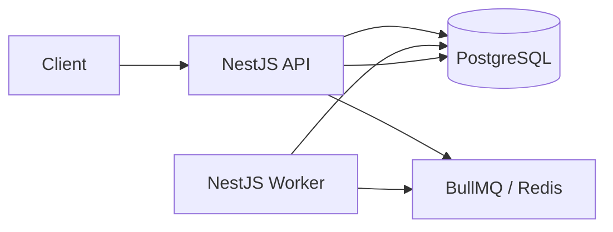

# Async Job Processing Platform

A scalable asynchronous job processing platform built with Node.js, TypeScript, and NestJS. Clients submit jobs through a REST API; work is persisted in PostgreSQL, queued in Redis via BullMQ, and processed by a separate worker process with automatic retries and operational visibility.

The design draws lightweight inspiration from concepts found in **AWS SQS**, **BullMQ**, and **Sidekiq**. External delivery (email, SMS, notifications) is **simulated** by logging payloads — the focus is queue mechanics, durability, and observability.

---

## Current Implementation Status

| Area | Status |
| ---- | ------ |
| Project workspace and NestJS scaffold | Initialized |
| Architecture design | Documented |
| API contract documentation | Documented |
| Database (Prisma schema) | Not implemented |
| Queue producer | Not implemented |
| Worker | Not implemented |
| Mandatory APIs | Not implemented |
| Bonus features | Not implemented |
| Tests | Not implemented |
| Docker Compose | Not implemented |

The repository currently contains a minimal NestJS scaffold under `apps/api`. Planned components listed below are **not yet built**.

---

## Features

### Mandatory features

- Submit jobs via REST API
- Persist job metadata in PostgreSQL
- Automatic asynchronous processing via BullMQ worker
- Simulated execution (payload logging)
- Lifecycle states: queued, processing, completed, failed
- Automatic retries with exponential backoff (3 total attempts)
- Get single job; list jobs with pagination, status filter, and sort
- Request validation (type, priority, payload)
- Structured lifecycle logging
- Docker Compose startup (planned)
- Architecture and API documentation

### Planned bonus features (initial implementation target)

- Priority queue (`high`, `normal`, `low`)
- Delayed and scheduled jobs
- Dead-letter visibility (PostgreSQL-backed view; dedicated BullMQ DLQ planned as future enhancement)
- Worker heartbeat
- Multiple workers
- Job cancellation (pre-processing)
- Queue pause and resume
- Health and metrics endpoints
- Swagger / OpenAPI
- Unit and integration tests
- Graceful shutdown

### Lower-priority optional features

- JWT authentication
- Rate limiting
- Optional web dashboard (`apps/web`)

---

## Tech Stack

| Technology | Role |
| ---------- | ---- |
| **Node.js** | Runtime |
| **TypeScript** | Type-safe application code |
| **NestJS** | API and worker application framework |
| **PostgreSQL** | Durable job and attempt storage |
| **Prisma** | ORM, schema, and migrations |
| **Redis** | BullMQ backend and worker heartbeat |
| **BullMQ** | Queue, retries, priority, delay, pause |
| **Docker Compose** | Local multi-service orchestration (planned) |
| **Swagger** | Interactive API docs (planned) |
| **Jest** | Unit and integration testing (planned) |

---

## Architecture



- The **API** validates requests, writes to PostgreSQL, and enqueues jobs. It does **not** run long-running work.
- The **worker** consumes from BullMQ, simulates processing, and updates PostgreSQL.
- **PostgreSQL** is the durable source of truth for job history and queries.
- **Redis/BullMQ** manages queue state, retries, and delays.

Full design, lifecycle diagrams, and ADRs: **[docs/DESIGN.md](./docs/DESIGN.md)**

---

## Repository Structure

```text
async-job-processing-platform/
├── apps/
│   └── api/                 # NestJS API and worker source (exists — scaffold only)
│       └── prisma/          # Planned — schema and migrations
│           ├── schema.prisma
│           └── migrations/
├── docs/
│   ├── DESIGN.md            # System design and ADRs
│   └── API.md               # Planned API contracts
├── docker-compose.yml       # Planned — local orchestration
├── package.json             # Root workspace config
└── README.md
```

**Not yet present:** `apps/web/`, `apps/api/prisma/`, `docker-compose.yml`, `.env.example`

---

## Prerequisites

Planned development prerequisites:

- **Node.js** — use an LTS release compatible with NestJS 11 (exact `engines` field to be added during implementation)
- **npm** — package management (workspaces enabled)
- **Docker** — container runtime
- **Docker Compose** — multi-service local startup
- **Git** — version control

---

## Environment Configuration

1. Copy `.env.example` to `.env` (`.env.example` planned).
2. **Never commit `.env`** — it is listed in `.gitignore`.

| Context | Hostnames |
| ------- | --------- |
| Local processes (outside Docker) | `localhost` for PostgreSQL and Redis |
| Docker Compose services | Service names such as `postgres` and `redis` |

### Planned environment variables

Operational values below are **environment-configurable defaults** (exact names subject to implementation):

| Variable | Description |
| -------- | ----------- |
| `PORT` | API HTTP port (default `3000`) |
| `DATABASE_URL` | PostgreSQL connection string |
| `REDIS_HOST` | Redis hostname |
| `REDIS_PORT` | Redis port |
| `QUEUE_NAME` | BullMQ queue name |
| `MAX_JOB_ATTEMPTS` | Total attempts (default `3`) |
| `JOB_BACKOFF_DELAY_MS` | Initial exponential backoff in ms (default `1000`) |
| `WORKER_CONCURRENCY` | Parallel jobs per worker (default `1`) |
| `WORKER_HEARTBEAT_INTERVAL_MS` | Heartbeat refresh interval in ms (default `5000`) |
| `WORKER_HEARTBEAT_TTL_MS` | Heartbeat stale threshold in ms (default `15000`) |

---

## Running Locally

> **Planned workflow — not yet verified.** Commands below describe the target developer experience once implementation is complete.

1. Install dependencies: `npm install`
2. Start PostgreSQL and Redis (local install or Docker)
3. Copy `.env.example` to `.env` and configure
4. Apply migrations: `npm exec --workspace=apps/api -- prisma migrate deploy`
5. Start API: `npm run dev:api`
6. Start worker: separate command TBD (e.g., `npm run start:worker --workspace=apps/api`)

---

## Running with Docker

Target command once Docker Compose is implemented:

```bash
docker compose up --build
```

Expected services:

- **api** — HTTP on port 3000
- **worker** — background processor (no public port)
- **postgres** — durable storage
- **redis** — queue backend
- **migrate** (optional) — one-time Prisma migrations

This is the **target** until implementation is complete.

---

## Database Migrations

Planned Prisma workflow (schema lives in `apps/api/prisma/`):

1. Define schema in `apps/api/prisma/schema.prisma`
2. Generate client: `npm exec --workspace=apps/api -- prisma generate`
3. Create development migration: `npm exec --workspace=apps/api -- prisma migrate dev`
4. Deploy in CI/Docker: `npm exec --workspace=apps/api -- prisma migrate deploy`
5. Commit migration SQL files under `apps/api/prisma/migrations/` to version control

`prisma db push` is **not** the final deployment process for production-like environments.

---

## API Documentation

| Resource | Location |
| -------- | -------- |
| Planned REST contracts | [docs/API.md](./docs/API.md) |
| Swagger UI (planned) | `http://localhost:3000/api/docs` |

Swagger is **not yet available**.

---

## Testing

Planned test categories (not yet implemented):

| Category | Scope |
| -------- | ----- |
| Unit tests | Validation, repositories, state transitions, metrics |
| Integration tests | API + DB + queue + worker flows |
| End-to-end lifecycle | Submit → process → complete / fail / retry |
| Docker smoke test | `docker compose up` and basic job submission |

Planned commands (subject to implementation):

```bash
npm run test:api          # unit tests
npm run test:e2e --workspace=apps/api   # integration/e2e
```

Platform-specific unit and integration tests are not yet implemented.

---

## Design Decisions

Architecture trade-offs and ADRs: **[docs/DESIGN.md#architecture-decision-records](./docs/DESIGN.md#architecture-decision-records)**

Endpoint contracts: **[docs/API.md](./docs/API.md)**

---

## Assumptions

See [docs/DESIGN.md — Assumptions](./docs/DESIGN.md#assumptions) for the full list. Key points: three total attempts, exponential backoff from 1000 ms, priorities `high` / `normal` / `low`, and `queueLength` = waiting jobs only.

---

## Known Limitations

Initial scope uses simulated processing, a PostgreSQL dead-letter view (not a separate queue), and no transactional outbox. See [docs/DESIGN.md — Known Limitations](./docs/DESIGN.md#known-limitations).

---

## Future Improvements

See [docs/DESIGN.md — Future Improvements](./docs/DESIGN.md#future-improvements). Planned production enhancements include transactional outbox, dedicated DLQ, idempotency keys, Prometheus metrics, and optional JWT/dashboard.

---

## Submission Checklist

- [x] GitHub repository
- [x] README
- [x] Architecture documentation (`docs/DESIGN.md`)
- [x] API contract documentation (`docs/API.md`)
- [ ] Swagger or Postman collection
- [ ] Docker Compose
- [ ] Database schema
- [ ] Migration files
- [ ] `.env.example`
- [ ] Mandatory APIs
- [ ] Worker
- [ ] Retry handling
- [ ] Validation
- [ ] Logging
- [ ] Unit tests
- [ ] Integration tests
- [ ] Clean Docker startup

---

## License

Private / UNLICENSED (see `apps/api/package.json`).
