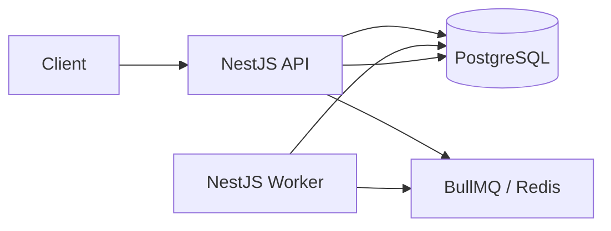

# Async Job Processing Platform

A scalable asynchronous job processing platform built with Node.js, TypeScript, and NestJS. Clients submit jobs through a REST API; work is persisted in PostgreSQL, queued in Redis via BullMQ, and processed by a separate worker process with automatic retries and operational visibility.

The design draws lightweight inspiration from concepts found in **AWS SQS**, **BullMQ**, and **Sidekiq**. External delivery (email, SMS, notifications) is **simulated** by logging payloads — the focus is queue mechanics, durability, and observability.

---

## Current Implementation Status

| Area | Status |
| ---- | ------ |
| Project workspace and NestJS scaffold | Initialized |
| Architecture design | Documented |
| API contract documentation | Documented |
| Prisma schema and initial migration | Implemented |
| Prisma module | Implemented |
| PostgreSQL and Redis development infrastructure | Implemented |
| BullMQ queue producer infrastructure | Implemented |
| JobsService / submission orchestration | Implemented |
| POST /api/jobs | Implemented |
| GET /api/jobs | Implemented |
| GET /api/jobs/:id | Implemented |
| Worker / automatic job processing | Implemented |
| Retry lifecycle synchronization | Implemented |
| POST /api/queue/pause | Implemented |
| POST /api/queue/resume | Implemented |
| GET /api/health | Implemented |
| GET /api/metrics | Implemented |
| Worker heartbeat | Implemented |
| DELETE /api/jobs/:id (job cancellation) | Implemented |
| GET /api/dead-letter-jobs | Implemented |
| Swagger / OpenAPI | Implemented |
| Cancellation and remaining job APIs | Not implemented |
| Bonus features | Not implemented |
| Bootstrap unit tests | Implemented |
| Platform integration tests | Not implemented |
| Docker Compose full application startup | Implemented |

The repository contains a NestJS API under `apps/api` and local PostgreSQL/Redis via Docker Compose. Job submission, querying, cancellation, worker processing, queue controls, health, and metrics are available; remaining operational APIs are **not yet built**.

**Job cancellation:** Only queued or delayed jobs (status `QUEUED`) may be cancelled. Active jobs cannot be stopped mid-processing. Cancellation is best-effort: if a worker acquires the job before BullMQ removal succeeds, the API returns `409 Conflict` and the durable record is left unchanged.

**Dead-letter visibility:** `GET /api/dead-letter-jobs` exposes permanently failed jobs from PostgreSQL as a durable view. This is not a separate BullMQ dead-letter queue.

---

## Features

### Mandatory features

- Submit jobs via REST API
- Persist job metadata in PostgreSQL
- Automatic asynchronous processing via BullMQ worker
- Simulated execution (payload logging)
- Lifecycle states: queued, processing, completed, failed
- Automatic retries with exponential backoff (3 total attempts)
- Get single job; list jobs with pagination, status filter, and sort
- Cancel queued or delayed jobs (`DELETE /api/jobs/:id`) — active jobs cannot be cancelled; best-effort due to worker race
- List permanently failed jobs (`GET /api/dead-letter-jobs`) — PostgreSQL-backed dead-letter view, not a separate queue
- Request validation (type, priority, payload)
- Structured lifecycle logging
- Queue pause and resume (`POST /api/queue/pause`, `POST /api/queue/resume`) — pause affects **waiting jobs only**; active jobs continue to completion
- Health checks (`GET /api/health`) — PostgreSQL, Redis, worker heartbeat, and live queue counts
- Metrics (`GET /api/metrics`) — historical stats from PostgreSQL, live queue depth from BullMQ (`queueLength` = waiting jobs only)
- Docker Compose startup
- Architecture and API documentation

### Planned bonus features (initial implementation target)

- Priority queue (`high`, `normal`, `low`)
- Delayed and scheduled jobs
- Dead-letter visibility (PostgreSQL-backed view; dedicated BullMQ DLQ planned as future enhancement)
- Multiple workers
- Job cancellation (pre-processing)
- Swagger / OpenAPI
- Unit and integration tests
- Graceful shutdown

### Lower-priority optional features

- JWT authentication
- Rate limiting
- Optional web dashboard (`apps/web`)

---

## Tech Stack

| Technology | Role |
| ---------- | ---- |
| **Node.js** | Runtime |
| **TypeScript** | Type-safe application code |
| **NestJS** | API and worker application framework |
| **PostgreSQL** | Durable job and attempt storage |
| **Prisma** | ORM, schema, and migrations |
| **Redis** | BullMQ backend and worker heartbeat |
| **BullMQ** | Queue, retries, priority, delay, pause |
| **Docker Compose** | Local PostgreSQL, Redis, and full platform containers |
| **Swagger** | Interactive API docs at `/api/docs` |
| **Jest** | Unit and E2E testing |

---

## Architecture



- The **API** validates requests, writes to PostgreSQL, and enqueues jobs. It does **not** run long-running work.
- The **worker** consumes from BullMQ, simulates processing, and updates PostgreSQL.
- **PostgreSQL** is the durable source of truth for job history and queries.
- **Redis/BullMQ** manages queue state, retries, and delays.

Full design, lifecycle diagrams, and ADRs: **[docs/DESIGN.md](./docs/DESIGN.md)**

---

## Repository Structure

```text
async-job-processing-platform/
├── apps/
│   └── api/                 # NestJS API and worker source
│       ├── prisma/          # Schema and migrations
│       │   ├── schema.prisma
│       │   └── migrations/
│       └── src/
│           ├── prisma/      # PrismaModule and PrismaService
│           ├── jobs/        # Job repositories
│           └── queue/       # BullMQ queue producer
├── docs/
│   ├── DESIGN.md            # System design and ADRs
│   └── API.md               # Planned API contracts
├── docker-compose.yml       # PostgreSQL, Redis, API, worker, migrate
├── Dockerfile               # Multi-stage API/worker image
├── package.json             # Root workspace config
└── README.md
```

**Not yet present:** `apps/web/`

---

## Prerequisites

Planned development prerequisites:

- **Node.js** — use an LTS release compatible with NestJS 11 (exact `engines` field to be added during implementation)
- **npm** — package management (workspaces enabled)
- **Docker** — container runtime
- **Docker Compose** — multi-service local startup
- **Git** — version control

---

## Environment Configuration

1. Copy `apps/api/.env.example` to `apps/api/.env`.
2. **Never commit `.env`** — it is listed in `.gitignore`.

| Context | Hostnames |
| ------- | --------- |
| Local processes (outside Docker) | `localhost` for PostgreSQL and Redis |
| Docker Compose services | Service names such as `postgres` and `redis` |

### Planned environment variables

Operational values below are **environment-configurable defaults** (exact names subject to implementation):

| Variable | Description |
| -------- | ----------- |
| `PORT` | API HTTP port (default `3000`) |
| `DATABASE_URL` | PostgreSQL connection string |
| `REDIS_HOST` | Redis hostname |
| `REDIS_PORT` | Redis port |
| `QUEUE_NAME` | BullMQ queue name |
| `MAX_JOB_ATTEMPTS` | Total attempts (default `3`) |
| `JOB_BACKOFF_DELAY_MS` | Initial exponential backoff in ms (default `1000`) |
| `WORKER_CONCURRENCY` | Parallel jobs per worker (default `1`) |
| `JOB_PROCESSING_DELAY_MS` | Simulated processing delay in ms (default `1000`) |
| `WORKER_HEARTBEAT_INTERVAL_MS` | Heartbeat refresh interval in ms (default `5000`) |
| `WORKER_HEARTBEAT_TTL_MS` | Heartbeat stale threshold in ms (default `15000`) |

---

## Running Locally

1. Install dependencies: `npm install`
2. Start PostgreSQL and Redis:

```bash
npm run infra:up
```

3. Copy `apps/api/.env.example` to `apps/api/.env`
4. Apply migrations: `npm run prisma:migrate:deploy --workspace=apps/api`
5. Start API: `npm run dev:api`
6. In a second terminal, start the worker:

```bash
npm run start:worker:dev --workspace=apps/api
```

Useful infrastructure commands:

```bash
npm run infra:down    # stop containers
npm run infra:logs    # follow postgres and redis logs
npm run infra:reset   # stop containers and remove volumes
```

---

## Running with Docker

Start the complete platform (PostgreSQL, Redis, migrations, API, worker):

```bash
npm run docker:up
```

Or directly:

```bash
docker compose up --build
```

No `.env` file is required for Docker Compose — service environment variables are defined in `docker-compose.yml`. Inside containers, PostgreSQL and Redis are reached by service name (`postgres`, `redis`). When running the API or worker **outside** Docker, use `localhost` (see `apps/api/.env.example`).

| Service | Host port | Purpose |
| ------- | --------- | ------- |
| **postgres** | 5433 | Durable storage (`jobs_db`; container listens on 5432) |
| **redis** | 6379 | BullMQ queue backend |
| **migrate** | — | Runs `prisma migrate deploy` once, then exits |
| **api** | 3000 | NestJS REST API |
| **worker** | — | BullMQ job processor (no public port) |

Startup order:

1. `postgres` and `redis` become healthy
2. `migrate` completes successfully
3. `api` and `worker` start

Useful URLs after startup:

| Resource | URL |
| -------- | --- |
| API liveness | [http://localhost:3000/api](http://localhost:3000/api) |
| Swagger UI | [http://localhost:3000/api/docs](http://localhost:3000/api/docs) |
| OpenAPI JSON | [http://localhost:3000/api/docs-json](http://localhost:3000/api/docs-json) |
| Health | [http://localhost:3000/api/health](http://localhost:3000/api/health) |
| Metrics | [http://localhost:3000/api/metrics](http://localhost:3000/api/metrics) |

Useful commands:

```bash
npm run docker:logs    # follow all service logs
npm run docker:down    # stop containers
npm run docker:reset   # stop containers and remove volumes
```

Infrastructure-only commands (PostgreSQL and Redis without API/worker):

```bash
npm run infra:up
npm run infra:down
npm run infra:logs
npm run infra:reset
```

Example job submission against the Dockerized API:

```bash
curl -X POST http://localhost:3000/api/jobs \
  -H "Content-Type: application/json" \
  -d '{
    "type": "EMAIL",
    "priority": "NORMAL",
    "payload": {
      "to": "john@example.com",
      "subject": "Docker test",
      "body": "Hello"
    }
  }'
```

---

## Database Migrations

Prisma schema lives in `apps/api/prisma/`. Start PostgreSQL first:

```bash
npm run infra:up
```

Common commands from the repository root:

```bash
npm exec --workspace=apps/api -- prisma validate
npm exec --workspace=apps/api -- prisma format
npm exec --workspace=apps/api -- prisma generate
npm exec --workspace=apps/api -- prisma migrate dev -- --name <migration_name>
npm exec --workspace=apps/api -- prisma migrate deploy
npm exec --workspace=apps/api -- prisma migrate status
```

Or from `apps/api`:

```bash
npm run prisma:generate
npm run prisma:migrate:dev
npm run prisma:migrate:deploy
```

Set `DATABASE_URL` in `apps/api/.env` (see `apps/api/.env.example`). Commit migration SQL files under `apps/api/prisma/migrations/`.

`prisma db push` is **not** used for deployment.

---

## API Documentation

| Resource | Location |
| -------- | -------- |
| REST contracts | [docs/API.md](./docs/API.md) |
| Swagger UI | [http://localhost:3000/api/docs](http://localhost:3000/api/docs) |
| OpenAPI JSON | [http://localhost:3000/api/docs-json](http://localhost:3000/api/docs-json) |

Interactive Swagger documentation is enabled by default for local development and assignment review. Production deployments may restrict or disable it.

Start the API with `npm run dev:api` (local) or `npm run docker:up` (Docker), then open the Swagger UI URL above.

---

## Testing

| Category | Scope |
| -------- | ----- |
| Unit tests | Validation, repositories, services, queue, worker, health, metrics |
| E2E tests | Jobs API, queue controls, health, metrics |
| Integration tests | API + DB + queue + worker flows |
| End-to-end lifecycle | Submit → process → complete / fail / retry |
| Docker smoke test | `docker compose up` and basic job submission |

Commands:

```bash
npm run test:api          # unit tests
npm run test:e2e --workspace=apps/api   # integration/e2e
```

---

## Design Decisions

Architecture trade-offs and ADRs: **[docs/DESIGN.md#architecture-decision-records](./docs/DESIGN.md#architecture-decision-records)**

Endpoint contracts: **[docs/API.md](./docs/API.md)**

---

## Assumptions

See [docs/DESIGN.md — Assumptions](./docs/DESIGN.md#assumptions) for the full list. Key points: three total attempts, exponential backoff from 1000 ms, priorities `high` / `normal` / `low`, and `queueLength` = waiting jobs only.

---

## Known Limitations

Initial scope uses simulated processing, a PostgreSQL dead-letter view (not a separate queue), and no transactional outbox. See [docs/DESIGN.md — Known Limitations](./docs/DESIGN.md#known-limitations).

---

## Future Improvements

See [docs/DESIGN.md — Future Improvements](./docs/DESIGN.md#future-improvements). Planned production enhancements include transactional outbox, dedicated DLQ, idempotency keys, Prometheus metrics, and optional JWT/dashboard.

---

## Submission Checklist

- [x] GitHub repository
- [x] README
- [x] Architecture documentation (`docs/DESIGN.md`)
- [x] API contract documentation (`docs/API.md`)
- [x] Swagger or Postman collection
- [x] Docker Compose
- [x] Database schema
- [x] Migration files
- [x] `.env.example` (`apps/api/.env.example`)
- [ ] Mandatory APIs
- [ ] Worker
- [ ] Retry handling
- [ ] Validation
- [ ] Logging
- [ ] Unit tests
- [ ] Integration tests
- [ ] Clean Docker startup

---

## License

Private / UNLICENSED (see `apps/api/package.json`).
