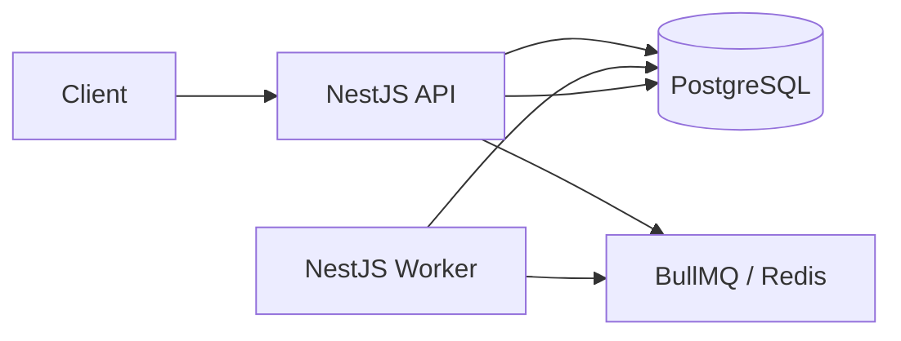

# Async Job Processing Platform

A scalable asynchronous job processing platform built with Node.js, TypeScript, and NestJS. Clients submit jobs through a REST API; work is persisted in PostgreSQL, queued in Redis via BullMQ, and processed by a separate worker process with automatic retries and operational visibility.

The design draws lightweight inspiration from concepts found in **AWS SQS**, **BullMQ**, and **Sidekiq**. External delivery (email, SMS, notifications) is **simulated** — the worker logs **payload keys** (not full values) and applies a configurable processing delay. The focus is queue mechanics, durability, and observability.

---

## Implementation Status

| Area | Status |
| ---- | ------ |
| Job submission (`POST /api/jobs`) | Implemented |
| Worker processing (separate NestJS process) | Implemented |
| Job status and listing | Implemented |
| Automatic retries (3 total attempts, exponential backoff) | Implemented |
| Priority queue (`HIGH`, `NORMAL`, `LOW`) | Implemented |
| Delayed jobs | Implemented |
| Scheduled jobs (`runAt`) | Implemented |
| Job cancellation (queued/delayed only) | Implemented |
| Queue pause and resume | Implemented |
| Dead-letter view (`GET /api/dead-letter-jobs`) | Implemented |
| Worker heartbeat | Implemented |
| Health endpoint | Implemented |
| Metrics endpoint | Implemented |
| Swagger / OpenAPI | Implemented |
| Unit tests | Implemented |
| E2E API tests | Implemented |
| Docker Compose (full platform) | Implemented |
| Graceful shutdown | Implemented |
| JWT authentication | Not implemented |
| Rate limiting | Not implemented |
| Web dashboard | Not implemented |

**Job cancellation:** Only jobs in status `QUEUED` (including delayed or scheduled jobs not yet active) may be cancelled. Active jobs cannot be stopped mid-processing. BullMQ removal happens before PostgreSQL is marked `CANCELLED`. If a worker acquires the job first, the API returns `409 Conflict` and the durable record is left unchanged.

**Dead-letter visibility:** `GET /api/dead-letter-jobs` exposes permanently failed jobs from PostgreSQL (`status = FAILED` with `retryCount > 0`). This is a durable view, not a separate BullMQ dead-letter queue. Enqueue failures (`retryCount = 0`) are excluded.

---

## Features

### Core capabilities

- Submit jobs via REST API with validation
- Persist job metadata and attempt history in PostgreSQL
- Automatic asynchronous processing via a separate BullMQ worker
- Simulated execution (payload **keys** logged, not values)
- Lifecycle states: `QUEUED`, `PROCESSING`, `COMPLETED`, `FAILED`, `CANCELLED`
- Automatic retries with exponential backoff (3 total attempts)
- Get single job (with attempts); list jobs with pagination, filters, and sort
- Cancel queued or delayed jobs (`DELETE /api/jobs/:id`)
- List permanently failed jobs (`GET /api/dead-letter-jobs`)
- Queue pause and resume — pause affects **waiting jobs only**; active jobs continue
- Health checks — PostgreSQL, Redis, worker heartbeat, live queue counts
- Metrics — historical stats from PostgreSQL, live queue depth from BullMQ
- Docker Compose startup for the full platform
- Architecture and API documentation

### Implemented bonus features

- Priority queue, delayed jobs, and scheduled jobs (`runAt`)
- PostgreSQL-backed dead-letter view
- Multiple worker instances supported by BullMQ (Docker Compose starts one worker by default)
- Swagger / OpenAPI at `/api/docs`
- Unit and E2E tests
- Graceful shutdown (Nest shutdown hooks, BullMQ/Prisma/Redis cleanup)

### Optional features (not implemented)

- JWT authentication
- Rate limiting
- Web dashboard

---

## Tech Stack

| Technology | Role |
| ---------- | ---- |
| **Node.js** | Runtime |
| **TypeScript** | Type-safe application code |
| **NestJS** | API and worker application framework |
| **PostgreSQL** | Durable job and attempt storage |
| **Prisma** | ORM, schema, and migrations |
| **Redis** | BullMQ backend and worker heartbeat |
| **BullMQ** | Queue, retries, priority, delay, pause |
| **Docker Compose** | Local PostgreSQL, Redis, migrate, API, and worker |
| **Swagger** | Interactive API docs at `/api/docs` |
| **Jest** | Unit and E2E testing |

---

## Architecture



- The **API** validates requests, writes to PostgreSQL, and enqueues jobs. It does **not** run long-running work.
- The **worker** consumes from BullMQ, simulates processing, and updates PostgreSQL.
- **PostgreSQL** is the durable source of truth for job history and queries.
- **Redis/BullMQ** manages queue state, retries, and delays.
- The database UUID is reused as the BullMQ job ID.

Full design, lifecycle diagrams, and ADRs: **[docs/DESIGN.md](./docs/DESIGN.md)**

---

## Repository Structure

```text
async-job-processing-platform/
├── apps/
│   └── api/
│       ├── prisma/              # Schema and migrations
│       ├── src/
│       │   ├── common/validation/
│       │   ├── config/
│       │   ├── health/
│       │   ├── jobs/
│       │   ├── metrics/
│       │   ├── prisma/
│       │   ├── queue/
│       │   ├── swagger/
│       │   ├── worker/
│       │   ├── main.ts          # API entrypoint
│       │   └── worker.ts        # Worker entrypoint
│       └── test/                # E2E tests
├── docs/
│   ├── DESIGN.md
│   └── API.md
├── docker-compose.yml
├── Dockerfile
├── package.json
└── README.md
```

---

## Prerequisites

- **Node.js** — LTS release compatible with NestJS 11
- **npm** — workspaces enabled at the repository root
- **Docker** and **Docker Compose** — for PostgreSQL, Redis, and full platform startup
- **Git**

---

## Environment Configuration

1. Copy `apps/api/.env.example` to `apps/api/.env`.
2. **Never commit `.env`** — it is listed in `.gitignore`.

| Context | Hostnames |
| ------- | --------- |
| Local processes (outside Docker) | `localhost` for PostgreSQL and Redis |
| Docker Compose services | Service names `postgres` and `redis` |

| Variable | Description | Default |
| -------- | ----------- | ------- |
| `NODE_ENV` | Runtime environment | `development` |
| `PORT` | API HTTP port | `3000` |
| `API_PREFIX` | Global route prefix | `api` |
| `DATABASE_URL` | PostgreSQL connection string | — |
| `REDIS_HOST` | Redis hostname | `localhost` |
| `REDIS_PORT` | Redis port | `6379` |
| `REDIS_PASSWORD` | Redis password (empty for local) | — |
| `QUEUE_NAME` | BullMQ queue name | `jobs` |
| `MAX_JOB_ATTEMPTS` | Total attempts per job | `3` |
| `JOB_BACKOFF_DELAY_MS` | Initial exponential backoff (ms) | `1000` |
| `WORKER_CONCURRENCY` | Parallel jobs per worker | `1` |
| `JOB_PROCESSING_DELAY_MS` | Simulated processing delay (ms) | `1000` |
| `WORKER_HEARTBEAT_INTERVAL_MS` | Heartbeat refresh interval (ms) | `5000` |
| `WORKER_HEARTBEAT_TTL_MS` | Heartbeat stale threshold (ms) | `15000` |

Docker Compose defines these variables inline in `docker-compose.yml`; no `.env` file is required for container startup.

---

## Running Locally

1. Install dependencies: `npm install`
2. Start PostgreSQL and Redis only:

```bash
npm run infra:up
```

3. Copy `apps/api/.env.example` to `apps/api/.env` and set `DATABASE_URL` to use **`localhost:5433`**. Docker Compose maps host port **5433** to PostgreSQL **5432** inside the container (`5433:5432` in `docker-compose.yml`).
4. Apply migrations:

```bash
npm run prisma:migrate:deploy --workspace=apps/api
```

5. Start the API: `npm run dev:api`
6. In a second terminal, start the worker:

```bash
npm run start:worker:dev --workspace=apps/api
```

Infrastructure-only commands (PostgreSQL and Redis without API/worker):

```bash
npm run infra:down
npm run infra:logs
npm run infra:reset
```

---

## Running with Docker

Start the complete platform (PostgreSQL, Redis, migrations, API, worker):

```bash
npm run docker:up
```

Or directly:

```bash
docker compose up --build
```

| Service | Host port | Purpose |
| ------- | --------- | ------- |
| **postgres** | 5433 | Durable storage (`jobs_db`; container listens on 5432) |
| **redis** | 6379 | BullMQ queue backend |
| **migrate** | — | Runs `prisma migrate deploy` once, then exits |
| **api** | 3000 | NestJS REST API |
| **worker** | — | BullMQ job processor (no public port) |

Startup order:

1. `postgres` and `redis` become healthy
2. `migrate` completes successfully (exit 0)
3. `api` and `worker` start

Useful URLs:

| Resource | URL |
| -------- | --- |
| API liveness | [http://localhost:3000/api](http://localhost:3000/api) |
| Swagger UI | [http://localhost:3000/api/docs](http://localhost:3000/api/docs) |
| OpenAPI JSON | [http://localhost:3000/api/docs-json](http://localhost:3000/api/docs-json) |
| Health | [http://localhost:3000/api/health](http://localhost:3000/api/health) |
| Metrics | [http://localhost:3000/api/metrics](http://localhost:3000/api/metrics) |

Docker commands:

```bash
npm run docker:logs
npm run docker:down
npm run docker:reset
```

Example job submission:

```bash
curl -X POST http://localhost:3000/api/jobs \
  -H "Content-Type: application/json" \
  -d '{
    "type": "EMAIL",
    "priority": "NORMAL",
    "payload": {
      "to": "john@example.com",
      "subject": "Docker test",
      "body": "Hello"
    }
  }'
```

---

## Database Migrations

Prisma schema lives in `apps/api/prisma/`. Start PostgreSQL first (`npm run infra:up` or `npm run docker:up`).

```bash
npm exec --workspace=apps/api -- prisma validate
npm exec --workspace=apps/api -- prisma format
npm exec --workspace=apps/api -- prisma generate
npm exec --workspace=apps/api -- prisma migrate dev -- --name <migration_name>
npm exec --workspace=apps/api -- prisma migrate deploy
npm exec --workspace=apps/api -- prisma migrate status
```

Or from `apps/api`:

```bash
npm run prisma:generate
npm run prisma:migrate:dev
npm run prisma:migrate:deploy
```

Commit migration SQL under `apps/api/prisma/migrations/`. `prisma db push` is not used for deployment.

---

## API Documentation

| Resource | Location |
| -------- | -------- |
| REST contracts | [docs/API.md](./docs/API.md) |
| Swagger UI | [http://localhost:3000/api/docs](http://localhost:3000/api/docs) |
| OpenAPI JSON | [http://localhost:3000/api/docs-json](http://localhost:3000/api/docs-json) |

Start the API with `npm run dev:api` (local) or `npm run docker:up` (Docker), then open the Swagger UI URL above.

---

## Testing

| Category | Scope |
| -------- | ----- |
| Unit tests | Validation, repositories, services, queue, worker, health, metrics (mocked dependencies) |
| E2E API tests | HTTP endpoints via Nest test application (mocked Prisma/Redis where applicable) |
| Manual Docker smoke tests | Full API + PostgreSQL + Redis + worker lifecycle (`docker compose up`, job submission, worker restart) |

Jest does **not** start real PostgreSQL, Redis, or worker processes for unit or E2E tests.

```bash
npm run build:api
npm run test:api
npm run test:e2e --workspace=apps/api
```

---

## Design Decisions

Architecture trade-offs and ADRs: **[docs/DESIGN.md#architecture-decision-records](./docs/DESIGN.md#architecture-decision-records)**

Endpoint contracts: **[docs/API.md](./docs/API.md)**

---

## Assumptions

See [docs/DESIGN.md — Assumptions](./docs/DESIGN.md#assumptions). Key points: three total attempts, exponential backoff from 1000 ms, request enums `EMAIL`/`SMS`/`NOTIFICATION` and `HIGH`/`NORMAL`/`LOW`, response statuses in uppercase, and `queueLength` = waiting jobs only.

---

## Known Limitations

Simulated processing, PostgreSQL dead-letter view (not a separate queue), no transactional outbox, no exactly-once delivery, no active-job cancellation, no JWT or rate limiting. See [docs/DESIGN.md — Known Limitations](./docs/DESIGN.md#known-limitations).

---

## Future Improvements

See [docs/DESIGN.md — Future Improvements](./docs/DESIGN.md#future-improvements). Includes transactional outbox, dedicated BullMQ DLQ, failed-job replay, idempotency keys, Prometheus export, and optional JWT/dashboard.

---

## Submission Checklist

- [x] GitHub repository
- [x] README
- [x] Architecture documentation (`docs/DESIGN.md`)
- [x] API contract documentation (`docs/API.md`)
- [x] Swagger or Postman collection
- [x] Docker Compose
- [x] Database schema
- [x] Migration files
- [x] `.env.example` (`apps/api/.env.example`)
- [x] Mandatory APIs
- [x] Worker
- [x] Retry handling
- [x] Validation
- [x] Logging
- [x] Unit tests
- [x] E2E API tests
- [x] Clean Docker startup

---

## License

UNLICENSED

This repository is submitted solely for technical evaluation.
