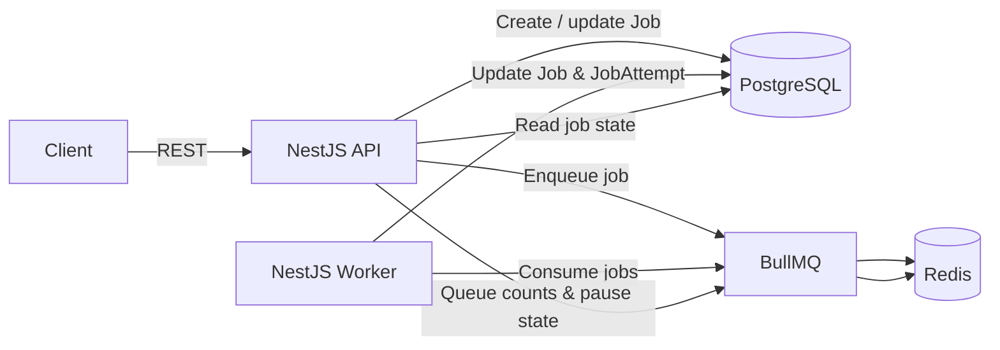
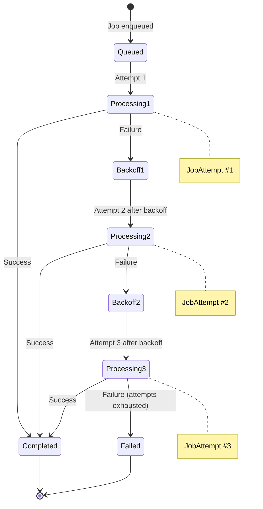
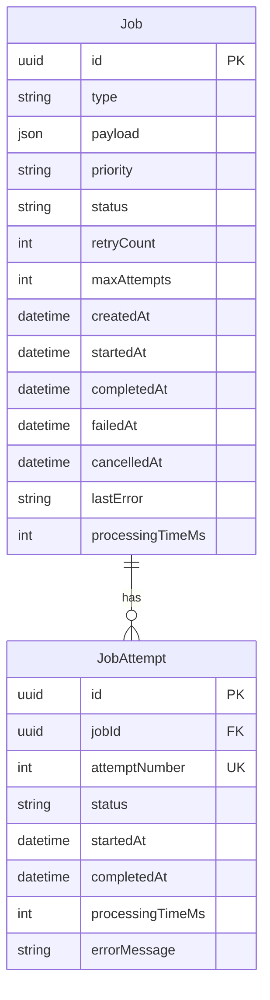
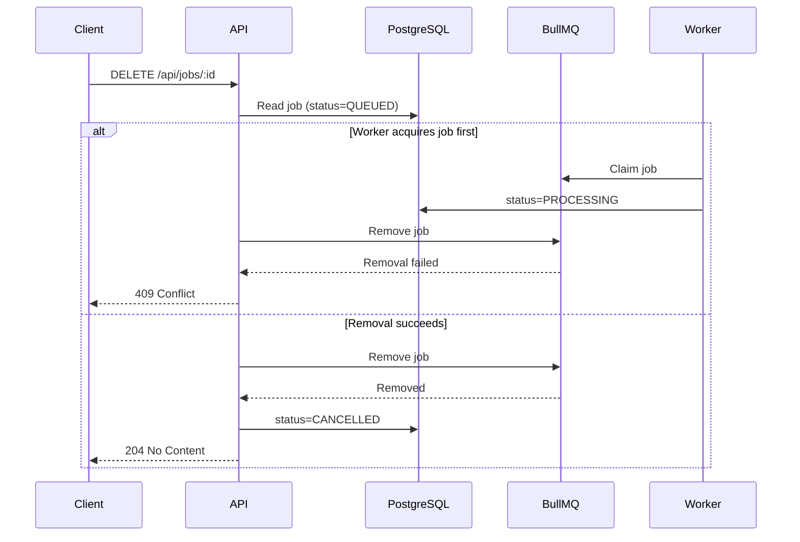
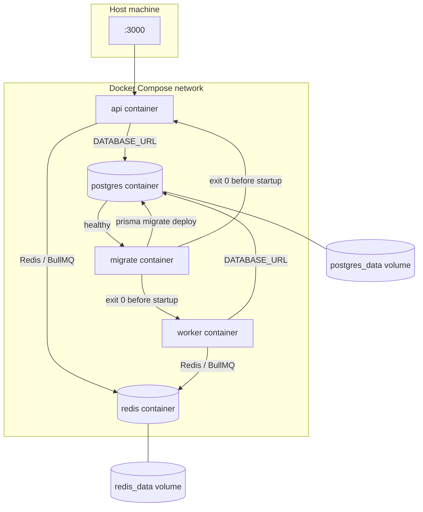
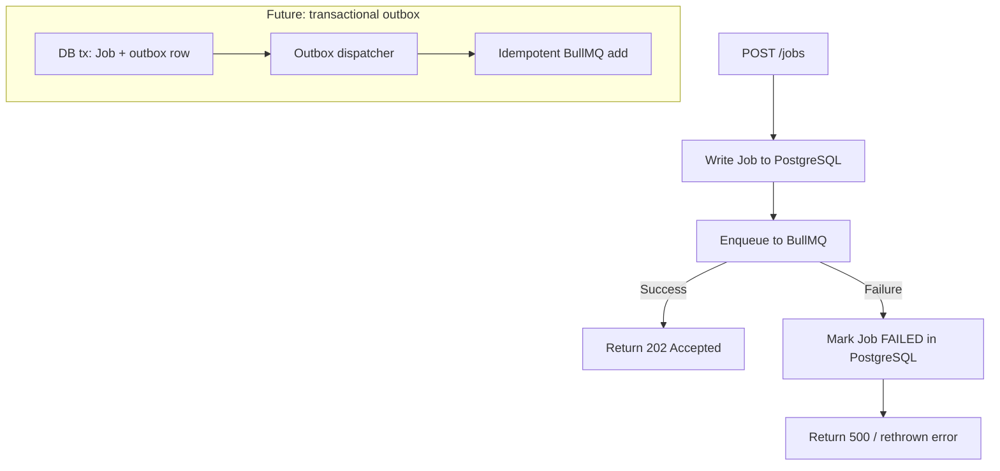
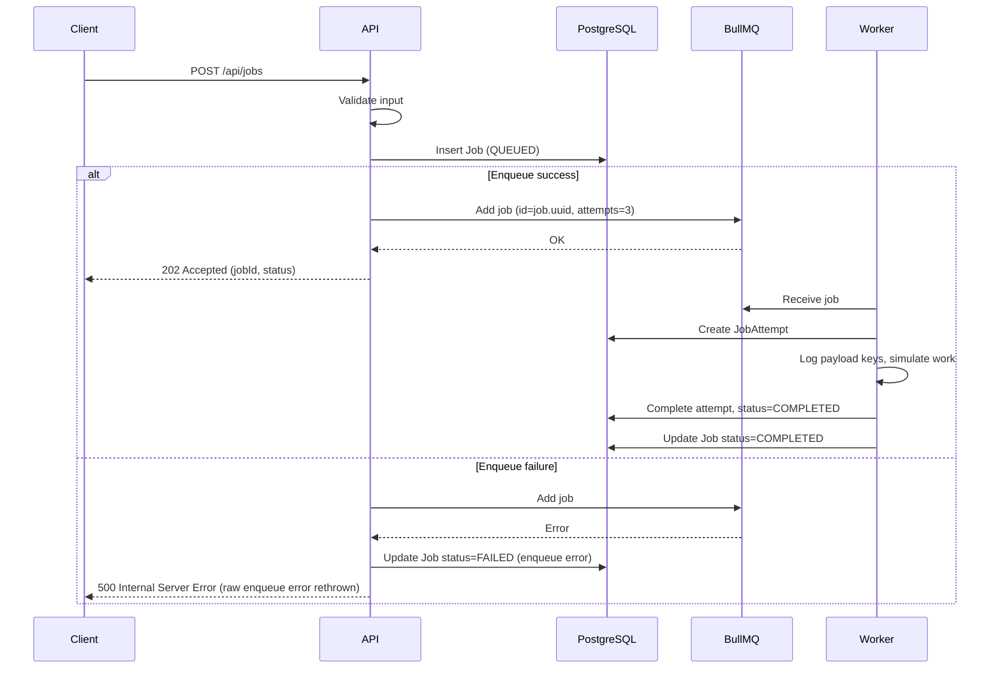

# System Design: Asynchronous Job Processing Platform

This document describes the architecture, behavior, and design decisions for the implemented asynchronous job processing platform. Sections labeled **Future improvements** describe enhancements not yet built.

---

## Problem Statement

The system accepts jobs through REST APIs, persists them durably, queues them for asynchronous execution, processes them through a separate worker process, retries transient failures automatically, and exposes job status and operational information to clients and operators.

Asynchronous processing is required because:

- **API requests should return quickly** — clients submit work and receive an acknowledgment without waiting for execution to finish.
- **Long-running work should not block HTTP requests** — email, SMS, and notification-style tasks may take seconds or longer and must not tie up API threads.
- **Processing should be independently scalable** — workers can be scaled horizontally without scaling the API tier.
- **Failed work should be retryable** — transient infrastructure or downstream errors should be handled with controlled retries rather than immediate permanent failure.
- **Job execution should remain observable and auditable** — operators and clients need durable status, attempt history, and operational metrics.

Job execution is **intentionally simulated** (the worker logs **payload keys**, not payload values) rather than calling real external providers. This keeps the focus on queue mechanics, persistence, retries, and observability.

---

## Functional Requirements

### Mandatory

| Requirement | Description |
| ----------- | ----------- |
| Submit a job | Accept job submissions via REST API with validated type, priority, and payload |
| Persist job metadata | Store durable job records in PostgreSQL before or alongside queue submission |
| Automatically process queued jobs | Worker consumes jobs from BullMQ without manual intervention |
| Simulate execution | Log payload keys and simulate processing; no real email/SMS delivery |
| Track lifecycle states | Support `QUEUED`, `PROCESSING`, `COMPLETED`, `FAILED`, and `CANCELLED` states |
| Retry failures automatically | Re-queue failed attempts with exponential backoff |
| Maximum three total attempts | One initial attempt plus up to two retries (three executions total) |
| List jobs with pagination | `GET /api/jobs` returns summary fields only (no payload) |
| Retrieve one job | `GET /api/jobs/:id` returns full job details including payload and attempts |
| Filter by status | Optional status filter on list endpoint |
| Sort by creation date | Default sort by `createdAt` ascending or descending |
| Validate payload, priority, and type | Reject invalid requests with structured errors |
| Log lifecycle events | Structured logs for major job and queue events |
| Start full system via Docker Compose | Single command local startup (`npm run docker:up`) |
| Document setup and design decisions | README, API reference, and this design document |

### Bonus

| Feature | Status |
| ------- | ------ |
| Priority queue (`HIGH`, `NORMAL`, `LOW`) | **Implemented** |
| Delayed jobs | **Implemented** |
| Scheduled jobs (`runAt`) | **Implemented** |
| Dead-letter visibility (PostgreSQL-backed view) | **Implemented** |
| Worker heartbeat | **Implemented** |
| Multiple workers | **Supported** (BullMQ; Docker Compose starts one worker by default) |
| Job cancellation (pre-processing only) | **Implemented** |
| Queue pause and resume | **Implemented** |
| Metrics (historical + live queue) | **Implemented** |
| Swagger / OpenAPI | **Implemented** |
| Unit tests | **Implemented** |
| E2E API tests | **Implemented** |
| Graceful shutdown | **Implemented** |
| JWT authentication | **Not implemented** |
| Rate limiting | **Not implemented** |
| Web dashboard | **Not implemented** |

---

## Non-Functional Requirements

| Category | Requirement |
| -------- | ----------- |
| **Reliability** | Durable job records survive process restarts; retries handle transient failures |
| **Maintainability** | Clear module boundaries, typed data access, documented ADRs |
| **Separation of concerns** | API handles HTTP and coordination; worker handles execution; PostgreSQL holds history; Redis/BullMQ handle queue mechanics |
| **Horizontal worker scalability** | Additional worker instances consume from the same queue |
| **At-least-once awareness** | Design assumes jobs may be delivered more than once in edge failure scenarios |
| **Idempotency readiness** | Processors and future safeguards should tolerate duplicate delivery |
| **Durable job history** | Jobs and attempts remain queryable after completion or failure |
| **Observability** | Structured lifecycle logs, health checks, and metrics endpoints |
| **Predictable failure handling** | Bounded retries, explicit terminal failure, dead-letter visibility |
| **Secure configuration** | Secrets via environment variables; `.env` excluded from version control |
| **Reproducible local setup** | Docker Compose for consistent developer and evaluation environments |
| **Testability** | Unit and E2E API tests for validation, state transitions, and HTTP contracts |
| **Reasonable API performance** | Read paths served from indexed PostgreSQL queries; submission returns promptly after persistence and enqueue |

Numerical performance targets (requests per second, latency percentiles) are intentionally omitted until baseline measurements exist.

---

## Scope

The system **includes**:

- NestJS REST API
- Separate NestJS worker process
- PostgreSQL persistence via Prisma
- Redis-backed BullMQ queue
- Job and attempt tracking (`Job`, `JobAttempt`)
- Automatic retries with exponential backoff (three total attempts)
- Priority, delay, and scheduling
- Status and listing APIs with pagination and filters
- Dead-letter visibility (PostgreSQL-backed view over permanently failed jobs; no separate queue in v1)
- Cancellation of jobs that have not started processing
- Queue pause and resume controls
- Health and metrics endpoints
- Swagger documentation
- Unit and E2E API tests
- Docker Compose orchestration

---

## Out-of-Scope Items

The submitted system **does not include**:

- Real email delivery
- Real SMS delivery
- Real notification provider integrations
- Production cloud deployment and advanced production hardening (secret managers, multi-region, etc.)
- Exactly-once delivery guarantees
- Arbitrary suspension of in-flight JavaScript execution (active-job pause)
- Full frontend dashboard

Job execution remains **simulated** by design for this stage.

---

## Assumptions

| Assumption | Detail |
| ---------- | ------ |
| Supported job types | `EMAIL`, `SMS`, `NOTIFICATION` (request and response) |
| Priority values | `HIGH`, `NORMAL`, `LOW` (request and response) |
| POST acknowledgement status | Lowercase `"queued"` in `POST /api/jobs` response only |
| Job status in GET responses | Uppercase (`QUEUED`, `PROCESSING`, …) |
| Payload storage | JSON column in PostgreSQL |
| Maximum attempts | Three **total** executions: one initial attempt plus up to two retries |
| Backoff | Exponential backoff starting at **1000 ms** (env: `JOB_BACKOFF_DELAY_MS`) |
| Worker concurrency | Defaults to **1** (env: `WORKER_CONCURRENCY`) |
| Worker heartbeat | Refresh every **5 s**, stale after **15 s** (env-configurable) |
| Source of truth | PostgreSQL for durable job and attempt history |
| Queue coordination | Redis via BullMQ |
| Shared job ID | Database UUID is also the BullMQ job ID |
| Queue length | Count of **waiting** jobs only; active and delayed reported separately |
| API timestamps | ISO 8601 UTC |
| Delivery semantics | At-least-once in some failure scenarios; processors should be idempotent |

---

## High-Level Architecture

1. A **client** calls the NestJS API to submit or query jobs.
2. The **API** validates the request.
3. The **API** creates a durable PostgreSQL `Job` record.
4. The **API** adds a BullMQ job to Redis (same UUID as job ID).
5. A **separate worker** process consumes jobs from BullMQ.
6. The **worker** updates PostgreSQL during lifecycle transitions and creates `JobAttempt` records.
7. The **API** reads job status and history from PostgreSQL for query endpoints.
8. **Health** and live queue counts read Redis/BullMQ state in addition to PostgreSQL connectivity checks.

The API **never** performs long-running job work itself.

### Diagram 1: High-Level Architecture



---

## Component Responsibilities

| Component | Responsibilities |
| --------- | ---------------- |
| **Client** | Submit jobs; read status; list jobs; use operational APIs (health, metrics, queue controls) |
| **API process** | HTTP handling; validation; persistence coordination; queue submission; job queries; cancellation; queue pause/resume; health and metrics; Swagger |
| **Worker process** | Pull jobs from BullMQ; create attempt records; simulate processing; update status; throw on failure for BullMQ retry; emit heartbeat; graceful shutdown |
| **PostgreSQL** | Durable job summary; attempt history; filtering and pagination; historical metrics; auditability |
| **Redis** | BullMQ queue state; job reservation; locks; delays; priorities; retries; pause state; worker heartbeat keys |
| **BullMQ** | Queue abstraction; retry scheduling; exponential backoff; priority; delayed execution; stalled-job recovery; concurrency coordination |
| **Prisma** | Schema and migrations under `apps/api/prisma/`; type-safe data access |
| **Docker Compose** | Reproducible startup; service networking; PostgreSQL; Redis; migrate; API; worker |

---

## API Process Versus Worker Process

The API and worker are **separate processes** (separate containers in Docker) because:

- **Failure isolation** — a crashing worker does not take down the API.
- **Independent scaling** — scale workers without scaling API replicas.
- **API responsiveness** — HTTP handlers remain lightweight.
- **Clear ownership** — submission vs execution concerns are separated.
- **Multiple workers** — several worker instances can share one queue.
- **Separate deployment and restart** — deploy or restart workers without API downtime.

**Trade-offs:**

- More configuration (two entrypoints, shared env, shared modules).
- Shared domain modules must be designed carefully to avoid circular dependencies.
- Worker health must be checked separately (heartbeat), not inferred from API health alone.

---

## PostgreSQL Responsibility

PostgreSQL stores the **durable business record** for each job:

- Job ID (UUID)
- Type, payload, priority
- Current status
- Retry count, maximum attempts
- Delay, scheduled time (`runAt`)
- Timestamps: created, started, completed, failed, cancelled
- Last error, `processingTimeMs`
- Every **`JobAttempt`** (per-execution history)

PostgreSQL powers:

- `GET /api/jobs` and `GET /api/jobs/:id`
- Historical metrics (completed, failed, average duration, success rate)
- Dead-letter visibility (`FAILED` jobs that exhausted attempts)
- Audit and debugging via attempt history

Redis is optimized for queue mechanics, not long-term querying and reporting.

---

## Redis and BullMQ Responsibility

Redis and BullMQ manage **operational queue state**:

- Waiting, active, and delayed jobs
- Priority ordering among waiting jobs
- Retry scheduling and exponential backoff
- Job locks and worker coordination
- Queue pause state
- Stalled job detection and recovery
- Worker heartbeat keys

Redis is **not** the long-term business source of truth. Completed job history lives in PostgreSQL.

---

## Job Lifecycle

### States

| Status | Description |
| ------ | ----------- |
| `QUEUED` | Persisted and enqueued (or waiting for delay/schedule); not yet processing |
| `PROCESSING` | Worker has claimed the job and an attempt is in progress |
| `COMPLETED` | Processing finished successfully |
| `FAILED` | All attempts exhausted; terminal failure |
| `CANCELLED` | Cancelled before processing started |

Delayed and scheduled jobs remain logically **`QUEUED`** until execution begins.

### Valid transitions

| From | To | Trigger |
| ---- | -- | ------- |
| `QUEUED` | `PROCESSING` | Worker starts attempt |
| `PROCESSING` | `COMPLETED` | Attempt succeeds |
| `PROCESSING` | `QUEUED` | Attempt fails with retries remaining |
| `PROCESSING` | `FAILED` | Attempt fails; attempts exhausted |
| `QUEUED` | `CANCELLED` | Successful cancellation before worker acquires job |

### Invalid transitions

| Transition | Reason |
| ---------- | ------ |
| `PROCESSING` → `CANCELLED` | Active jobs cannot be cancelled in v1 |
| `COMPLETED` → `CANCELLED` | Terminal success state |
| `FAILED` → `CANCELLED` | Terminal failure state |
| Any terminal → non-terminal | No resurrection without explicit replay (future) |

---

## Retry Lifecycle

Jobs are configured for **three total attempts** with exponential backoff starting at **1000 ms**. On failure, the worker records a `JobAttempt`, updates the parent `Job`, and re-queues until attempts are exhausted.

| Term | Definition |
| ---- | ---------- |
| `attemptNumber` | `attemptsMade + 1` at execution time |
| `retryCount` | Number of **failed** attempts |
| Success on third try after two failures | `retryCount = 2` |
| Permanent failure after three attempts | `retryCount = 3` |

### Diagram 3: Retry Lifecycle



---

## Job Attempt History

### Relationship

- One **`Job`** has many **`JobAttempt`** records.
- **`Job`** enables fast current-state queries.
- **`JobAttempt`** provides detailed execution history.

### JobAttempt fields

| Field | Description |
| ----- | ----------- |
| Attempt number | 1, 2, or 3 (unique per job) |
| Status | `PROCESSING`, `COMPLETED`, or `FAILED` (written by worker) |
| `startedAt` | When attempt began |
| `completedAt` | When attempt finished |
| `processingTimeMs` | Processing duration in milliseconds |
| `errorMessage` | Present on failure |

The Prisma schema also defines `STALLED` as an attempt status, but the worker does not persist it today. BullMQ stalled-job events are logged operationally (`JOB_STALLED`) without updating attempt records.

### Benefits and costs

`JobAttempt` records provide retry audit trails and per-attempt timing at the cost of additional writes and schema complexity.

### Diagram 6: Job and JobAttempt Relationship



Unique constraint: `(jobId, attemptNumber)`.

---

## Priority Jobs

| API priority | BullMQ priority | Notes |
| ------------ | --------------- | ----- |
| `HIGH` | 1 | Lower BullMQ number = higher priority |
| `NORMAL` | 5 | Required on submission |
| `LOW` | 10 | Deprioritized among waiting jobs |

Priority affects **waiting** jobs only. A high-priority job does **not** preempt an already active job.

---

## Delayed and Scheduled Jobs

### Delay

- Client supplies `delay` in milliseconds (non-negative integer).
- BullMQ holds the job until the delay expires.
- Job remains logically `QUEUED` in PostgreSQL until processing starts.

### Scheduled run time

- Client supplies `runAt` as ISO 8601 UTC.
- API computes `delay = runAt - now`.
- Past `runAt` values are rejected.
- **`delay` and `runAt` are mutually exclusive.**

---

## Dead-Letter Handling

### Implemented approach

- Jobs that exhaust all **three total attempts** are marked **`FAILED`** in PostgreSQL and remain in the `Job` table.
- `GET /api/dead-letter-jobs` queries permanently failed jobs from PostgreSQL — a **PostgreSQL-backed dead-letter view**.
- Filter: `status = FAILED` and `retryCount > 0` (excludes enqueue failures with `retryCount = 0`).
- Failed jobs are **not moved** to a separate queue; the endpoint is a durable, filterable view over existing records.

### Future enhancement

- A **dedicated BullMQ dead-letter queue (DLQ)** could remove permanently failed jobs from the primary queue and route them to a separate Redis-backed queue for replay or inspection.

### Why the PostgreSQL-backed view initially

- Lower implementation risk
- Durable failure history already exists in `Job` and `JobAttempt`
- Easier querying, filtering, and pagination
- Adequate for the assignment

A dedicated BullMQ DLQ remains a **future enhancement** and is not part of the submitted implementation.

---

## Cancellation Behavior and Race Condition

1. Only **`QUEUED`** or delayed (not yet active) jobs may be cancelled.
2. Active jobs cannot be cancelled.
3. API reads durable PostgreSQL state.
4. API loads the BullMQ job by UUID.
5. API attempts BullMQ removal.
6. PostgreSQL is marked **`CANCELLED`** only **after** BullMQ removal succeeds.
7. If the worker acquires the job first, removal fails → API returns **HTTP 409 Conflict**.

PostgreSQL and Redis **cannot** participate in a single distributed transaction.

### Diagram 4: Cancellation Race



---

## Queue Pause and Resume Behavior

- **`POST /api/queue/pause`** — prevents new **waiting** jobs from being assigned; **active** jobs continue to completion.
- **`POST /api/queue/resume`** — waiting jobs become eligible for assignment again.
- Pausing does **not** freeze arbitrary in-flight JavaScript; active execution runs to completion or failure.
- Pausing active work mid-execution would require cooperative checkpoints and persisted progress (out of scope).

---

## Worker Heartbeat

Worker liveness uses a single Redis key (not a public API contract):

```text
worker:heartbeat
```

| Setting | Default | Environment variable |
| ------- | ------- | -------------------- |
| Refresh interval | 5 seconds | `WORKER_HEARTBEAT_INTERVAL_MS` |
| Stale threshold / TTL | 15 seconds | `WORKER_HEARTBEAT_TTL_MS` |

The worker sets `worker:heartbeat` to the current timestamp (`SET … PX <ttl>`) on an interval. On shutdown, the key is deleted. The health endpoint treats the worker as running when the key exists and `(Date.now() - heartbeat) < WORKER_HEARTBEAT_TTL_MS`.

**Limitation:** Heartbeat proves recent process activity, not per-job progress.

---

## Health and Metrics Approach

Health and metrics are **separate concerns**.

### Health (`GET /api/health`)

| Check | Source |
| ----- | ------ |
| API process | Process is running and handling requests |
| PostgreSQL | `$queryRaw SELECT 1` connectivity probe |
| Redis | `PING` connectivity probe |
| Worker heartbeat | Redis key `worker:heartbeat` age vs TTL |
| Queue counts | BullMQ: waiting, active, delayed, completed, failed |

Response `status` values: `ok`, `degraded`, `down`.

| Overall status | HTTP | Condition |
| -------------- | ---- | --------- |
| `ok` | 200 | DB + Redis connected; worker heartbeat fresh |
| `degraded` | 200 | DB + Redis connected; worker heartbeat stale or missing |
| `down` | **503** | PostgreSQL or Redis disconnected |

### Historical metrics (PostgreSQL)

| Metric | Definition |
| ------ | ---------- |
| Completed jobs | Count where status = `COMPLETED` |
| Permanently failed jobs | Count where status = `FAILED` |
| Jobs processed | `completedJobs + failedJobs` |
| Average processing time | Mean of `processingTimeMs` for completed jobs |
| Success rate | `completedJobs / jobsProcessed * 100`; **0** when `jobsProcessed = 0` |

### Live BullMQ metrics (`GET /api/metrics`)

| Metric | Definition |
| ------ | ---------- |
| `queueLength` | Waiting jobs only |
| `activeJobs` | Jobs currently being processed |
| Pause state | Not exposed on metrics endpoint (use health queue counts or queue controls) |

---

## Logging Strategy

Structured lifecycle log events emitted by the application:

| Event | Source | When |
| ----- | ------ | ---- |
| `JOB_RECEIVED` | API | Job persisted, before enqueue |
| `JOB_QUEUED` | API | Successfully enqueued |
| `JOB_ENQUEUE_FAILED` | API | BullMQ enqueue failed |
| `JOB_CANCEL_REQUESTED` | API | Cancellation requested |
| `JOB_CANCELLED` | API | Cancellation succeeded |
| `JOB_CANCEL_CONFLICT` | API | Cancellation rejected (409 path) |
| `DEAD_LETTER_JOBS_LISTED` | API | Dead-letter list queried |
| `WORKER_STARTED` | Worker | Worker process up |
| `WORKER_STOPPING` | Worker | Graceful shutdown begins |
| `WORKER_JOB_COMPLETED` | Worker | BullMQ job handler succeeded |
| `WORKER_JOB_FAILED` | Worker | BullMQ job handler failed |
| `WORKER_ERROR` | Worker | Worker infrastructure error |
| `JOB_STARTED` | Worker | Attempt begins (DB updated) |
| `JOB_PROCESSING` | Worker | Simulated work starts (`payloadKeys` logged, not values) |
| `JOB_COMPLETED` | Worker | Attempt/job succeeds |
| `JOB_FAILED` | Worker | Final attempt fails |
| `JOB_RETRY_SCHEDULED` | Worker | Non-final attempt fails, retry pending |
| `JOB_STALLED` | Worker | BullMQ stalled-job event (operational) |

Each log includes the fields relevant to that event, such as job ID, job type, attempt number, retry count, duration, and error message.

---

## Graceful Shutdown

Both API and worker call `app.enableShutdownHooks()`. NestJS `OnModuleDestroy` handlers run on SIGTERM/SIGINT:

### API

1. Stop accepting new HTTP requests (Nest shutdown).
2. Close BullMQ queue connection (`queue.close()`).
3. Disconnect Prisma (`$disconnect()`).
4. Close Redis connection (`quit()`).

### Worker

1. Stop accepting new jobs (`worker.close()` — waits for active jobs).
2. Clear heartbeat interval and delete `worker:heartbeat`.
3. Close BullMQ worker and queue connections.
4. Disconnect Prisma and Redis.

Docker Compose does not configure a custom `stop_grace_period`; rely on Nest/BullMQ close semantics and container default stop timeout.

---

## Docker Architecture

### Compose services

| Service | Role |
| ------- | ---- |
| `postgres` | Durable storage (host port **5433** → container 5432) |
| `redis` | BullMQ backend |
| `migrate` | One-time `prisma migrate deploy` (runs before API/worker) |
| `api` | NestJS HTTP server (port 3000) |
| `worker` | NestJS worker (no public port) |

- API and worker share the **same Docker image** with different commands.
- Internal hostnames: `postgres`, `redis` (not `localhost` inside containers).
- Health checks gate API readiness; migrate must exit 0 before API/worker start.
- Named volumes persist PostgreSQL and Redis data.

### Diagram 5: Docker Service Topology



---

## Data Consistency Concerns

### Dual-write problem

1. API creates PostgreSQL job.
2. API adds BullMQ job.
3. PostgreSQL may succeed while Redis enqueue fails (or vice versa in edge cases).

### Initial handling

1. Create PostgreSQL job (`QUEUED`).
2. Attempt BullMQ enqueue.
3. If enqueue fails: mark PostgreSQL job **`FAILED`**, store enqueue error, return infrastructure error to client.

**Limitation:** No atomic cross-store transaction.

### Production improvement: transactional outbox

1. Within a DB transaction: insert `Job` + outbox event.
2. Dispatcher reads outbox, enqueues to BullMQ idempotently.
3. Dispatcher marks outbox event delivered.

### Diagram 7: Dual-Write Flow



---

## Idempotency Considerations

The queue provides **at-least-once** delivery in some failure scenarios (for example, a worker crash after a side effect but before acknowledgment). Job processors should be designed for **idempotency**. Future safeguards may include idempotency keys and processed-operation tracking.

---

## Security Considerations

- Validate request data and reject unknown fields.
- Enforce a maximum pagination `pageSize` of **100**.
- Do not commit `.env`; provide `.env.example`.
- Do not expose raw stack traces or internal errors in API responses.
- Avoid logging sensitive payload values; the worker logs **payload keys** only.
- Restrict Swagger and queue control endpoints in production.
- **Not implemented:** JWT authentication and rate limiting.

---

## Testing Strategy

### Unit tests (implemented)

- Job submission validation and schedule rules
- Repository interactions (mocked Prisma)
- Enqueue failure handling and reconciliation
- Retry state transitions and simulation fields
- Priority mapping to BullMQ
- Delay and `runAt` calculation
- Cancellation conflict detection
- Metrics and health calculations
- Queue pause/resume

### E2E API tests (implemented)

- HTTP endpoints via Nest test application
- Jobs CRUD, cancellation, dead-letter listing
- Queue controls, health, metrics, Swagger
- Dependencies mocked where appropriate (no real PostgreSQL/Redis required)

### Manual Docker runtime verification

- `docker compose up --build` starts postgres, redis, migrate, api, worker
- Migrations apply successfully (migrate exits 0)
- API health, metrics, Swagger respond
- Worker processes submitted jobs end-to-end
- Worker restart and second job completion

---

## Known Limitations

- No transactional outbox in v1
- PostgreSQL-backed dead-letter **view** (not a separate queue); dedicated BullMQ DLQ is a future enhancement
- Simulated processing only
- Worker heartbeat is a basic availability signal
- No exactly-once guarantee
- No active-job cancellation
- JWT and dashboard remain optional
- Metrics are application-level JSON, not Prometheus format unless added later

---

## Future Improvements

- Transactional outbox pattern
- Dedicated BullMQ dead-letter queue and manual replay endpoint
- Idempotency keys and processed-operation tracking
- Job-type-specific retry policies and retry jitter
- Prometheus metrics export and OpenTelemetry tracing
- Autoscaling or multiple named workers
- Payload retention and cleanup policies
- JWT and role-based access control
- Optional web dashboard

---

## Architecture Decision Records

### ADR Summary

| ID | Decision | Selected option | Main reason | Main trade-off |
| -- | -------- | --------------- | ----------- | -------------- |
| ADR-001 | Job queue implementation | BullMQ with Redis | Mature retry, priority, delay, pause semantics | Redis operational dependency |
| ADR-002 | Durable source of truth | PostgreSQL + Redis | Queryable history plus fast queue ops | Dual-write consistency |
| ADR-003 | Data access layer | Prisma ORM | Type-safe schema and migrations | ORM abstraction overhead |
| ADR-004 | Process model | Separate API and worker | Independent scale and failure isolation | Two deployables to configure |
| ADR-005 | Data access pattern | Repository pattern | Testability and swappable persistence | Extra abstraction layer |
| ADR-006 | Job identifier | Shared UUID across PG and BullMQ | Correlation and debugging simplicity | Enqueue must use same ID |
| ADR-007 | Attempt tracking | Job + JobAttempt tables | Audit trail vs summary table | More writes and schema |
| ADR-008 | Retry policy | 3 attempts, exponential backoff from 1s | Predictable, assignment-aligned behavior | Not job-type-specific |
| ADR-009 | Dead-letter view | PostgreSQL failed jobs | Reuse existing durable data | No separate DLQ mechanics |
| ADR-010 | Cancellation scope | Pre-processing only | Avoids in-flight complexity | No mid-run cancel |
| ADR-011 | Pause semantics | Pause waiting only | Matches BullMQ capabilities | Active jobs finish |
| ADR-012 | Worker liveness | Redis heartbeat keys | Simple crash detection | Does not prove per-job progress |
| ADR-013 | Metrics split | PG historical + BullMQ live | Correct semantics per metric type | Two data sources |
| ADR-014 | Local orchestration | Docker Compose | Reproducible dev and evaluation | Not production K8s |
| ADR-015 | Execution model | Simulated logging | Focus on platform mechanics | Not production delivery |

---

### ADR-001: BullMQ versus custom queue

| | |
| - | - |
| **Status** | Accepted |
| **Context** | Need reliable async job processing with retries, delays, priorities, and pause/resume. |
| **Alternatives** | (1) BullMQ with Redis; (2) PostgreSQL queue via `SELECT FOR UPDATE SKIP LOCKED`; (3) Fully custom Redis queue |
| **Decision** | Use **BullMQ with Redis**. |
| **Reasons** | BullMQ provides retry backoff, priority, delay, pause, and stalled recovery without custom queue code. A PostgreSQL `SELECT FOR UPDATE SKIP LOCKED` queue would increase database polling load and lacks built-in delay/priority semantics. A fully custom Redis queue would recreate these features with higher maintenance risk. |
| **Benefits** | Faster delivery, community support, NestJS integration patterns, operational features out of the box. |
| **Trade-offs** | Additional Redis dependency; queue state split from PostgreSQL. |
| **When an alternative would be preferable** | PostgreSQL-only queue if Redis operations are prohibited; custom queue if extremely specialized ordering or routing is required. |

---

### ADR-002: PostgreSQL as durable source of truth

| | |
| - | - |
| **Status** | Accepted |
| **Context** | Job status, history, and reporting must survive restarts and support rich queries. |
| **Alternatives** | (1) Redis/BullMQ only; (2) PostgreSQL only as queue; (3) PostgreSQL + Redis |
| **Decision** | **PostgreSQL for durable records; Redis/BullMQ for queue operations.** |
| **Reasons** | PostgreSQL excels at relational queries, pagination, and audit history; Redis excels at low-latency queue coordination. |
| **Benefits** | Durable audit trail; indexed filters; clear separation of operational vs historical data. |
| **Trade-offs** | Dual-write consistency must be handled explicitly. |
| **When an alternative would be preferable** | Redis-only for ephemeral tasks with no audit requirement; PostgreSQL-only for minimal infrastructure at small scale. |

---

### ADR-003: Prisma ORM

| | |
| - | - |
| **Status** | Accepted |
| **Context** | Need typed data access and migration workflow for PostgreSQL. |
| **Alternatives** | (1) Prisma; (2) TypeORM; (3) Raw SQL / `node-postgres` |
| **Decision** | Use **Prisma**. |
| **Reasons** | Strong TypeScript integration, declarative schema, migration tooling, and generated client types. |
| **Benefits** | Compile-time safety; consistent migration story; good NestJS ecosystem fit. |
| **Trade-offs** | ORM learning curve; some complex queries may need raw SQL. |
| **When an alternative would be preferable** | TypeORM if team standardizes on decorators; raw SQL for maximum query control. |

---

### ADR-004: Separate API and worker processes

| | |
| - | - |
| **Status** | Accepted |
| **Context** | Long-running job work must not block HTTP handling. |
| **Alternatives** | Monolith processing in API; separate worker; serverless workers |
| **Decision** | **Separate NestJS worker process** sharing code with API. |
| **Reasons** | Independent scaling, failure isolation, and clear boundaries. |
| **Benefits** | Responsive API; horizontal worker scaling; independent restarts. |
| **Trade-offs** | Two processes to deploy, monitor, and configure. |
| **When an alternative would be preferable** | Monolith for trivial workloads; serverless for spiky, fully managed scale. |

---

### ADR-005: Repository pattern

| | |
| - | - |
| **Status** | Accepted |
| **Context** | Services should not embed raw Prisma calls everywhere. |
| **Alternatives** | Direct Prisma in services; repository abstraction; active record |
| **Decision** | **Repository pattern** for `Job` and `JobAttempt` persistence. |
| **Reasons** | Easier unit testing with mocks; centralized query logic; swappable persistence for tests. |
| **Benefits** | Testability; consistent data access; cleaner services. |
| **Trade-offs** | Additional interfaces and boilerplate. |
| **When an alternative would be preferable** | Direct Prisma in very small codebases with minimal test surface. |

---

### ADR-006: Shared PostgreSQL and BullMQ job UUID

| | |
| - | - |
| **Status** | Accepted |
| **Context** | Operators must correlate queue jobs with database records. |
| **Alternatives** | Separate BullMQ-generated IDs; shared UUID; mapping table |
| **Decision** | **Use the PostgreSQL job UUID as the BullMQ job ID.** |
| **Reasons** | Single identifier across logs, API, DB, and Redis; simpler cancellation and debugging. |
| **Benefits** | End-to-end traceability without join tables. |
| **Trade-offs** | Enqueue logic must explicitly set job ID; ID generation must occur before enqueue. |
| **When an alternative would be preferable** | Mapping table if external systems impose incompatible ID formats. |

---

### ADR-007: Job and JobAttempt tables

| | |
| - | - |
| **Status** | Accepted |
| **Context** | Need both fast current state and per-execution history. |
| **Alternatives** | Single job table only; event sourcing; Job + JobAttempt |
| **Decision** | **`Job` summary table plus `JobAttempt` history table.** |
| **Reasons** | Normalized model balances query performance and audit detail. |
| **Benefits** | Rich retry debugging; clear attempt timeline. |
| **Trade-offs** | More schema and write logic. |
| **When an alternative would be preferable** | Single table if attempt history is never queried; event sourcing for full audit replay. |

---

### ADR-008: Three total attempts with exponential backoff

| | |
| - | - |
| **Status** | Accepted |
| **Context** | Assignment requires bounded automatic retries. |
| **Alternatives** | Fixed delay; linear backoff; exponential from 1s; unlimited retries |
| **Decision** | **3 total attempts; exponential backoff starting at 1000 ms.** |
| **Reasons** | Matches requirements; reduces thundering herd vs fixed rapid retries. |
| **Benefits** | Predictable terminal failure; standard BullMQ configuration. |
| **Trade-offs** | Same policy for all job types initially. |
| **When an alternative would be preferable** | Per-type policies when failure modes differ (e.g., rate-limited APIs). |

---

### ADR-009: PostgreSQL-backed dead-letter view

| | |
| - | - |
| **Status** | Accepted |
| **Context** | Operators need visibility into permanently failed jobs. |
| **Alternatives** | BullMQ DLQ; PostgreSQL query; external DLQ service |
| **Decision** | **`GET /api/dead-letter-jobs` queries permanently failed jobs in PostgreSQL (`FAILED`, `retryCount > 0`). Implemented as a dead-letter view, not a separate queue. A dedicated BullMQ DLQ is a future enhancement.** |
| **Reasons** | Failure data already durable; simpler than operating a second queue. |
| **Benefits** | Pagination, filters, and attempt history in one store. |
| **Trade-offs** | No BullMQ-native DLQ replay mechanics. |
| **When an alternative would be preferable** | Dedicated BullMQ DLQ when failed jobs should be **moved** out of the primary queue and re-driven from queue infrastructure at scale. |

---

### ADR-010: Cancellation only before processing

| | |
| - | - |
| **Status** | Accepted |
| **Context** | Clients want to cancel jobs that should not run. |
| **Alternatives** | Cancel anytime; pre-processing only; soft cancel flag |
| **Decision** | **Allow cancellation only for queued/delayed jobs; reject with 409 if active or terminal.** |
| **Reasons** | Avoids cooperative cancellation complexity in v1. |
| **Benefits** | Clear semantics; race handled via BullMQ removal before DB update. |
| **Trade-offs** | Cannot stop in-flight work. |
| **When an alternative would be preferable** | Long-running jobs requiring checkpoint-based cancel or kill signals. |

---

### ADR-011: Queue pause does not pause active jobs

| | |
| - | - |
| **Status** | Accepted |
| **Context** | Operators need to stop new work during incidents or maintenance. |
| **Alternatives** | Pause all including active; pause waiting only; drain then stop |
| **Decision** | **Pause affects waiting jobs only; active jobs complete.** |
| **Reasons** | Aligns with BullMQ pause semantics and avoids unsafe mid-execution freezes. |
| **Benefits** | Simple, predictable operational behavior. |
| **Trade-offs** | Active jobs continue during pause. |
| **When an alternative would be preferable** | Workloads requiring hard stop with persisted checkpoints. |

---

### ADR-012: Redis worker heartbeat

| | |
| - | - |
| **Status** | Accepted |
| **Context** | Health endpoint must reflect worker availability separately from API. |
| **Alternatives** | Process manager only; HTTP worker health port; Redis heartbeat |
| **Decision** | **Redis key `worker:heartbeat` (single key), refreshed every 5s with 15s TTL (env-configurable).** |
| **Reasons** | Lightweight; works across multiple workers; auto-expires on crash. |
| **Benefits** | Simple liveness signal for health checks. |
| **Trade-offs** | Does not detect stuck job handlers. |
| **When an alternative would be preferable** | Per-job progress monitoring or supervisor with active job inspection. |

---

### ADR-013: Historical metrics versus live queue metrics

| | |
| - | - |
| **Status** | Accepted |
| **Context** | Operators need both throughput history and current queue depth. |
| **Alternatives** | Single source; split PG vs BullMQ; external metrics store |
| **Decision** | **PostgreSQL for historical aggregates; BullMQ for live queue counts.** |
| **Reasons** | Each store holds the authoritative data for its metric type. |
| **Benefits** | Correct definitions (`queueLength` = waiting only); accurate success rate from completed history. |
| **Trade-offs** | Metrics endpoint aggregates two sources. |
| **When an alternative would be preferable** | Unified time-series DB (Prometheus) for all operational metrics. |

---

### ADR-014: Docker Compose

| | |
| - | - |
| **Status** | Accepted |
| **Context** | Evaluators and developers need one-command local startup. |
| **Alternatives** | Manual local installs; Docker Compose; full K8s locally |
| **Decision** | **Docker Compose** for PostgreSQL, Redis, migrate, API, and worker. |
| **Reasons** | Reproducible, documented, appropriate for assignment scope. |
| **Benefits** | Consistent environments; isolated dependencies. |
| **Trade-offs** | Not production orchestration; Compose files require maintenance. |
| **When an alternative would be preferable** | Production multi-node orchestration beyond local Docker Compose. |

---

### ADR-015: Failure simulation controls

| | |
| - | - |
| **Status** | Accepted |
| **Context** | Retry and failure paths must be testable without real downstream failures. |
| **Alternatives** | Mock worker only; payload flags; environment-based failure injection |
| **Decision** | **Optional payload fields `shouldFail` and `failUntilAttempt` evaluated by the worker during processing (not validated at the API layer).** |
| **Reasons** | `shouldFail: true` fails every attempt. `failUntilAttempt: N` (integer) fails attempts 1..N then succeeds on the next. If both are present, `shouldFail` is checked first and causes every attempt to fail. |
| **Benefits** | Repeatable failure scenarios; no external dependency. |
| **Trade-offs** | Must not be enabled blindly in production; document as dev/test controls. |
| **When an alternative would be preferable** | Dedicated fault-injection service in advanced chaos testing. |

---

## Job Submission and Processing Sequence

### Diagram 2: Job Submission and Processing Sequence



---
